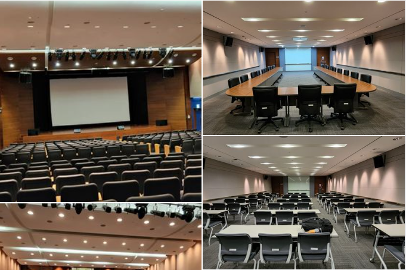
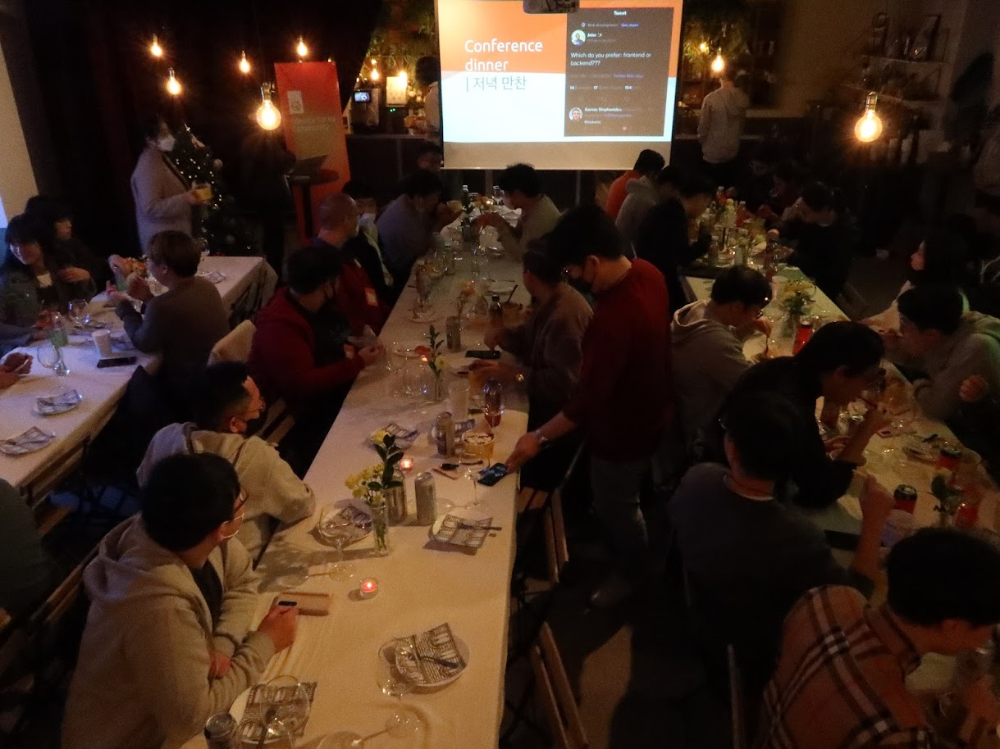
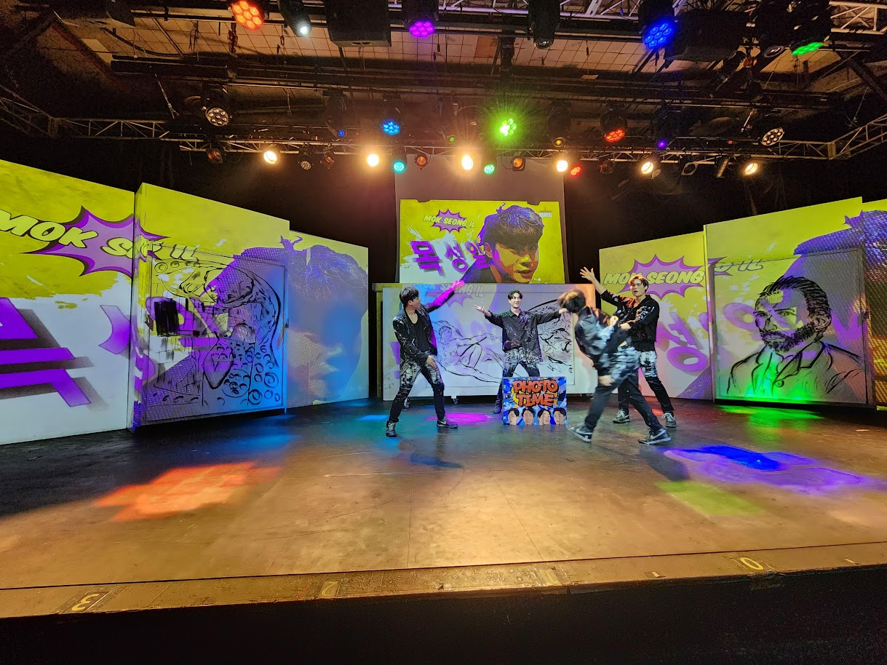
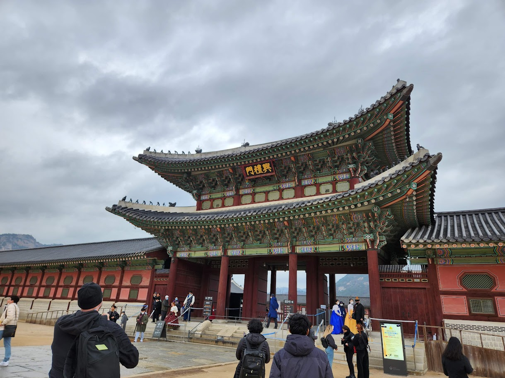
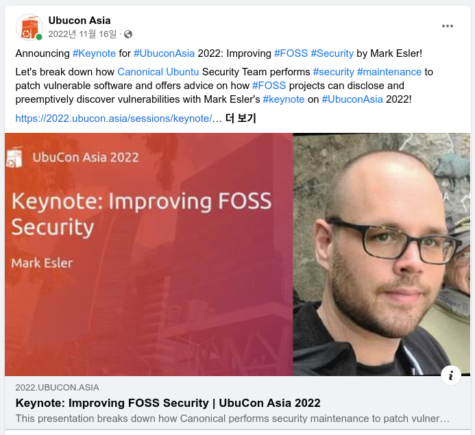
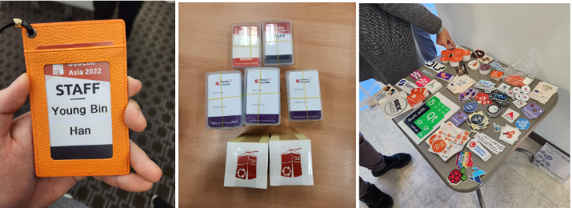
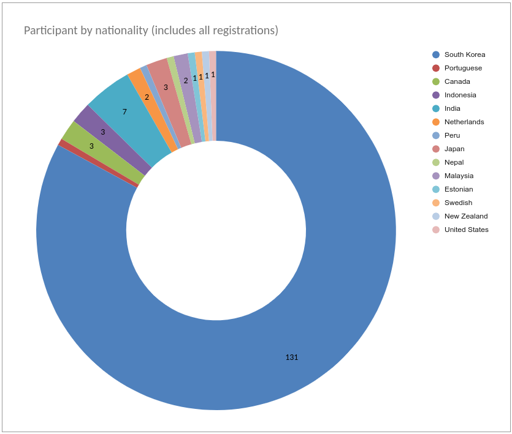
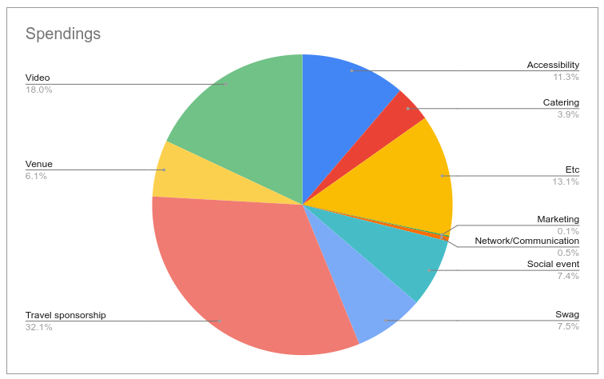
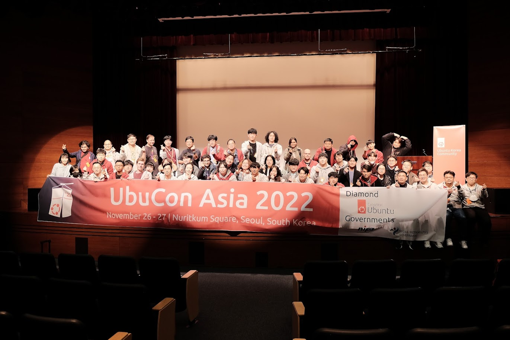

---
title: "UbuCon Asia 2022 - Post event report"
date: 2023-02-04T02:00:00+09:00
authors:
    - name: Youngbin Han
      bio: Organizer, Ubucon Asia 2022 / Leader, Ubuntu Korea Community 
      email: youngbin@ubuntu-kr.org
      launchpad: sukso96100
      github: sukso96100
      profile: https://avatars2.githubusercontent.com/u/1916739?s=460&v=4
      linkurl: https://youngbin.xyz
      linklabel: Website
---

> [This event report is also available as PDF file](report.pdf)

## Overview

The second edition of UbuCon Asia year was the first in-person and online hybrid event we prepared. In 2022, It happened in Seoul, South Korea from November 26 to 27. This post event report provides how the organizing team prepared the event, and what lessons they’ve learned.

For Korean LoCo, the 2022 event is a big achievement made with more than 5 years of continuous efforts to build a network between Ubuntu LoCos around Asia and eventually make the first UbuCon Asia happen in 2021, and the first in-person event in 2022.

## The team

Compared to the 2021 event, We gathered the 2022 team organizers quite late. This is because early 2022 COVID-19 situations were not good enough yet to start organizing in-person events. The team was organized around June with diverse people from the Asian region. As the event was held in South Korea, organizers from Ubuntu Korean LoCo mostly led the event preparation.

### Team members

|Global/Local/Both|Name|Affiliation|Roles|
|--- |--- |--- |--- |
|Both|Youngbin Han|Ubuntu KR|General, Contents, Web and Video, Sponsorship and Finances, Travel support|
|Both|Gyuseok Jung|Ubuntu KR|General, Web and Video|
|Local|Junhyeon Bae|Ubuntu KR|Sponsorship and Finances|
|Both|Sangkon Han|Ubuntu KR|Contents|
|Local|Giyeon Bang|C++ Korea|General, Web and VIdeo|
|Local|Joowon Jung|Ubuntu KR|Web and video, Marketing|
|Local|Minseong Cho|Ubuntu KR|Contents, Marketing|
|Local|Jongmin Kim|N/A|Sponsorship and Finances, Travel support, Marketing|
|Global|Vincent Wong|N/A|Content|
|Global|Burgess Chang|Ubuntu Kylin|Web and Video|
|Global|Ravi Bhattarai|FOSS Nepal|General, Content|
|Global|Khairul Aizat Kamarudzzaman|Ubuntu Malaysia||
|Global|Masafumi Ohta|Raspberry Pi Japan|Content, Travel support, Marketing|
|Global|Rudra B. Saraswat|Ubuntu Unity|Content|
|Global|Robbi Nespu|Debian Malaysia|Sponsorship and Finances|
|Global|Muhd Syazwan Md Khusaini|Ubuntu Malaysia||

### Meetings

Just like last year, We tried to find the best time that would work for most of the organizers and had bi-weekly meetings. But this time, We did video call meetings using Jitsi Meet. We also published our meeting notes along with video recordings so that people who couldn’t participate can follow up later. For publishing meeting notes, We used Ubuntu Discourse instead of Ubuntu Wiki as Ubuntu Wiki is quite buggy and frequently frustrates our organizers.

There were two separate periodic meetings, Global team meetings where mostly global team people and few Korean organizers who speak English joined. And Local team meeting organized by Korean LoCo.

All meeting notes can be found from the link below.

https://discourse.ubuntu.com/t/ubucon-asia-2022-meeting-notes-thread/29715/26

## Venue

As we started to organize the event quite late, Acquiring a venue was not easy. Our venue candidates were COEX, AT Center, Microsoft Korea, DDP, Nuritkum Square and a few more other places. But most venues on our list already closed the reservation due to other events, did not meet our requirements or were not available due to renovations. Nuritkum square was the only choice left for our event. Thanks to the sponsorship from NIPA(A government agency in Korea), Although It wasn’t easy and there were some delays due to their requirements, we could acquire the venue for free anyway.

The venue itself is located in Seoul but far from the center of the city. So, It was not much accessible compared to other venues in Gangnam, Seoul. But It did provide most necessary facilities and many large events already held at Nuritkum square. It was also accessible for people coming from overseas since it’s near both Incheon and Gimpo International Airport.

### Venue facilities

Our event venue was consisted of 4 rooms, a reception and a lobby. Most talks were scheduled at the International conference room. (3F) And some talks and all workshops were scheduled at Large conference room. (4F). There were also 2 midsized conference rooms. One was used for BoF, and the other one was just used for a lounge for participants. At the lobby, We installed exhibition booths for sponsors so that our participants and sponsors meet and get to know each other.

### Network and power strip setup

While the venue provided most facilities we needed, They did not provide fast and stable network connection and power strips. They do have wired and WiFi available in each room, But it was only 100mbps and shared with all other offices in the same building. As we needed a stable and dedicated network, We made a short-term contract with a network provider and installed a dedicated network connection for live streaming and BoF video calls. We also rented or bought many power strips and installed them at the venue for the workshop room and sponsored exhibition booths in the lobby.

## Content and programs

### Call for proposals

We received 53 talks and workshop proposals. Proposals were selected with 2 steps. First step was to filter out spam, too broad topics or simply not suitable for our event. (e.g. “Insider Threat: What is Social Engineering?”, “Values in Tech - Just a Buzzword or an Action-Item?”) For some proposals that suggest interesting topics but do not provide sufficient information or are not really related to Ubuntu, We contacted applicants and provided some feedback to improve their proposal.

Then we selected proposals for our schedule slots by voting “Accept”, “Pending” or “Reject”. We selected proposals with most “Accept” votes first and filled out schedule slots. As the event was held in Korea and many Korean participants are usually not used to listening to English speech, We allocated slots for sessions in Korean.

### Conference programs

Our 2 days of conference programs were filled with various talks, workshops, lightning talks and a few BoFs. Among 53 proposals, We selected 25 proposals. with sponsored talks, keynotes, total number of sessions are the same as follows. We largely accepted proposals in 2 languages: English and Korean. For talks scheduled at the International conference room, We provided simultaneous interpretation between English and Korean so that both local and overseas speakers can communicate with audiences.

||English|Korean|Other|Total|
|--- |--- |--- |--- |--- |
|Talks (including opening, closing, keynote and sponsored)|12|9|1 (Japanese)|22|
|Workshops|1|4|0|5|
|Lightning talks|2|1|0|3|
|BoF|0|1|0|1|

### Live streams and video recordings

For sessions scheduled at the International conference room, We provided live streaming via YouTube so that online participants can join. Simultaneous interpretations were not provided for either live streaming or recording since it required double or triple more service fees due to copyright of the interpretation. Sessions at other rooms were not streamed, But recorded as videos. 

To provide streaming and recordings, we made a contract with a local live streaming provider on live streaming and recording services with equipment rent. Most session streams and recordings are now available on our YouTube and PeerTube.

- [Video recordings on YouTube](https://www.youtube.com/playlist?list=PLr8g8zdbZAgFiXUM4q4N78ytxiQTRjgc6)
- [Video recordings on PeerTube(LinuxRocks Instance)](https://peertube.linuxrocks.online/w/p/edg9ytogatwDDTb7Qcc8MR)

### Social events

We had 2 social events at UbuCon Asia 2022. Conference dinner on Day 1, and a Group tour after Day 2

#### Conference dinner

It wasn’t easy to prepare the dinner event due to many restrictions and requirements. Since the venue has restrictions on bringing foods and beverages on-site, And there were also some participants who required a vegan or halal meal which was unfortunately difficult to find nearby the venue. Our initial plan was to make a buffet reservation at the 4 stars hotel where we also booked some rooms for our speakers and organizers.

Unfortunately, they did not cover any vegan or halal meals. Most large restaurants nearby also did not meet our dietary requirements. So, We tried to find some alternative solutions rather than hotel buffets or restaurant reservations. Among many alternative ideas we brought, Our solution was to rent a party room nearby and bring a catering service that meets our dietary requirements to that place.

After overcoming many difficulties, We managed to host a quite decent conference dinner for participants. At a fancy party room near Hongik University, We served beef and chicken platter from halal guys catering. Also with some beers and beverages. Our plan was to provide both halal and vegan meals through catering service from halal guys, But after reducing catering quantity and on that day, they didn’t bring the vegan meal. So, for those who needed vegan meals, We bought salad boxes from the salad shop nearby.

#### Group tour

For the group tour, We arranged a guided tour through a local tour agency. The tour program included visiting Insa-dong, Gyeongbokgung palace, Bukchon Hanok Village and watching a painting performance show. Lunch and dinner were also included. 

## Marketing & Swags

To spread out our event, We tried diverse ways to promote our event. We mostly used our UbuCon Asia and Korean LoCo’s social media (Facebook, Twitter, Mastodon, LinkedIn) to promote the event. To spread out through social media more easily, paid social media ads were also used. Thanks to help from many other folks like Ubuntu Weekly Newsletter team, conference event calendar (such as LWN.net’s event calendar) website or social media account were also helpful to spread out. 

For marketing on social media, We also tried to generate thumbnail images for each website page to make the webpage sharing more attractive without working hard on authoring promotion graphics.

Community partners such as Openstack Korea Group, WSL Korea User Group, It has nothing to do with coding, LibreOffice Korea, Wise Azure Life, openSUSE Korea and much more) also provided big help with promotions and gathering diverse participants to make the event successful.

One thing missing with promotion would be in-person campaigns. Such as publishing event posters on public boards of universities, Some promotional sessions on other events.

For swags, Our initial plan was to provide necklace wallets, stickers, neck warmers(for attendees), and hoodies(for speakers, staff and patrons). Due to delays with placing orders for swags, Neck warmers were canceled but other swags were provided to participants. Thanks to Jose from Ubuntu Community Council bringing a lot of stickers from Ubuntu Summit 2022, We could also set up another sticker table for participants. 

## Travel support

Hotels, Flights, Visa sponsorship were provided for selected participants. Due to limitations on budget, We could only sponsor speakers, a few staff and participants. Hotels were booked by our team with 25 rooms we acquired, While flights were mostly sponsored with reimbursement after the event except for a few people who don’t have enough cash to book flights. Plus, Thanks to the Seoul Tourism Organization, We could also provide travel insurance for overseas speakers.

Visa invitations were provided under the name of Korean LoCo’s business registration for overseas speakers who need it. Working with documents for visa invitations by ourselves was unexpectedly very tricky to prepare. This was because of strict visa document requirements of the Korean diplomatic mission. (e.g. requiring physically original visa invitation documents or sometimes notarized documents) and sometimes because of Korean immigrants' strict policy on specific nationalities or changes on immigration policy.

### Some numbers on travel support

|||
|--- |--- |
|Hotel rooms provided|18 people|
|Flight support provided|8 people|
|Visa invitation provided|5 people|
|Travel insurance sign up|11 people|

## Participants

Our goal was to bring about 350 participants (including speakers and staff) to the event. Unfortunately, as we started many things quite late (from start organizing the event to beginning attendee registration and promotions). We could invite only about less than half of our goal, But managed to bring more than hundreds. 

Including online participants, We received a total 158 registrations 126 actual checked in participants. While most participants were from South Korea, there were also some overseas participants such as Japan, India, Indonesia, Nepal, Peru, Canada, Portugal, Malaysia, United States, Estonia and few more.

If we break down by jobs, Most participants were Students and Software Engineers. Followed by Community Organizers, those who have IT infrastructure related jobs (System Engineer, Cloud Solutions Architect), Researcher. 

## Sponsorship and Finances

### Income

#### Sponsors & Sponsorship programs

As an in-person event requires a huge amount of budget compared to the previous virtual event. The 2022 event’s sponsorship package pricing was also largely increased. Due to travel sponsorship budget and Live translation budget, our initial total budget amount was almost a hundred million Korean won (Approx 80,600 USD). At first, this resulted in making sponsorship pricing very huge even compared to major community conferences in Korea and made our sponsorship gathering goal not much feasible. Slowdown in the economy caused by hiked interest rates, Our late sponsorship reach out (which was around early September) also made sponsorship gathering much more difficult.

After receiving some feedback from some few potential sponsors. We tried to cut off our budget as much as we can, and also greatly lowered our sponsorship pricing and provide more benefits so that sponsors can make much easier decisions with confidence on sponsoring our event.

With our continued efforts right before the event took place, Even in these difficult economic times, 13 sponsors joined us to make the event successful! This is twice more numbers compared to the 2021 event. Thank you again to our sponsors: NIPA, Seoul Tourism Organization, Canonical, Elastic, Invesume, Naver Cloud, Onlyoffice, Cloudmate, NHN Cloud, GroMetric, Inflearn, Microsoft Korea and WhaTap Labs.

Unfortunately, As we couldn’t brough enough overseas participants, Seoul Tourism Organization canceled their cash sponsorship. As we worked very hard on paperworks to get sponsorship through their program, We would like to have received their sponsorship. Fortunately, Some In kind sponsorships (such as travel insurance, Quarantine supplies) were still provided which was also helpful for us to organize the event.

#### Individual patrons

After finishing the 2022 event, We would also like to thank our many individual patrons for the donations. Thanks to a lot of patrons (which was 44 in total 44), We could manage our event finances with more ease and spend a bit more on the event.

List of individual patrons can be found on our website. Note that only patrons who agreed to list their name on our website are shown.

[https://2022.ubucon.asia/patrons/](https://2022.ubucon.asia/patrons/) 

#### At a glance

|||
|--- |--- |
|Sponsorships|56,648,827 KRW|
|Ticket sales (Including individual patrons, on-site swag sales)|6,324,192 KRW|
|Total|62,973,019 KRW|

### Spendings

|Category|Description|Amount in KRW|
|--- |--- |--- |
|Video|Live streaming, recording and Audio setup with administration|8,800,000 KRW|
|Accessibility|Simultaneous interpretations service and equipments rental|5,500,000 KRW|
|Social event|Guided group tour (For 15 people)|2,327,600 KRW|
|Social event|Conference dinner venue rental|1,265,000 KRW|
|Catering|Conference dinner catering (Halal guys, For 50 people)|1,031,000 KRW|
|Catering|Conference dinner vegan meal boxes (3 boxes)|26,100 KRW|
|Catering|Conference dinner alcoholic drinks (44 bottles)|132,300 KRW|
|Catering|Lunch for speakers and staff (For both 2 days)|699,000 KRW|
|Catering|Water bottles for speakers and staff (500ml * 48 bottles)|38,000 KRW|
|Venue|Venue contract fee (About 10% total rental fee)|1,288,078 KRW|
|Venue|Silver sponsor backdrop stand rental with shipping fee (For 3 booths)|264,000 KRW|
|Venue|Silver sponsor backdrop printout (For 3 booths)|76,890 KRW|
|Venue|Diamond sponsor booth rental|1,078,000 KRW|
|Venue|Lobby main banner printout (2 banners)|41,360 KRW|
|Venue|International conference room banner|30,140 KRW|
|Venue|5 Standing banners with stands for breakout rooms|181,500 KRW|
|Venue|Standing banner with registration sign|12,540 KRW|
|Network/Communication|LTE Walkie talkie rental (10 devices)|154,000 KRW|
|Network/Communication|Dedicated wired network setup for live streaming and BoF video calls|74,430 KRW|
|Marketing|Facebook Paid ADs|67,066 KRW|
|Swag|Necklace wallet for holding nametag (250 wallets)|1,146,750 KRW|
|Swag|150 Nametag inserts|142,000 KRW|
|Swag|1000 Stickers|32,000 KRW|
|Swag|Hoodies for speakers, staff and patrons (112 hoodies)|2,167,800 KRW|
|Swag|Online speaker swag (4 T-shirts)|41,500 KRW|
|Swag|Online speaker swag shipping fee|154,740 KRW|
|Travel sponsorship|Hotels (Booking fee for 25 rooms paid before event)|1,350,000 KRW|
|Travel sponsorship|Hotels (Usage fee for 18 rooms paid after event: 7 remaining rooms were canceled)|5,285,000 KRW|
|Travel sponsorship|Flights (8 people)|8,973,286 KRW|
|Travel sponsorship|Visa invitation document notarization fee (1 set)|42,750 KRW|
|Etc|Office supplies (Pens, nametag stickers, tapes, box cutters, etc.)|27,000 KRW|
|Etc|Package shipping fee|50,800 KRW|
|Etc|Car parking fee|158,000 KRW|
|Etc|Fiscal host fee (15% of total amount paid by fiscal host)|6,156,634 KRW|
| - | Total | 48,815,264 KRW |

### Remaining amount

||KRW|USD (Assume 1 USD = 1241.60 KRW)|
|--- |--- |--- |
|Income|62,973,019 KRW|Approx 50,719.26 USD|
|Spenings|48,815,264 KRW|Approx 39,316.43 USD|
|Remaining|14,157,755 KRW|Approx 11,402.83 USD|

## Conclusion

We can say the 2022 event is quite successful in many aspects, but there were also many failures and rooms for improvements. We managed to organize the first in-person UbuCon Asia without any accident, big issues and financial loss. 

But there were many delays with starting organizing the event, gathering sponsors and attendees which resulted in bringing less than half of our goal number of participants. Event dates overlap with national level events (College entrance exam, Final exam period for most students) other big global events (e.g. AWS re:invent right after a few days, Ubuntu Summit a few weeks before) also made it difficult to bring participants.

So, We could say it was a half success. But it was also a big first step forward for the next UbuCon Asia events. Using the 2022 event as reference, Hope we can see more success in the 2023 event!

## 2023?

We have currently two host city candidates: Proposal to host in Nepal (Lalitpur) with Software freedom day co-location, and another proposal to host in Indonesia (Surakarta or Malang) by former GNOME.Asia 2019 organizers. Already looking forward to seeing UbuCon Asia 2023 happening? Keep looking at Ubuntu Discourse as we usually post UbuCon Asia updates there. Also, If you’re interested in sponsoring UbuCon Asia 2023, you may contact us by email [contact@ubucon.asia](mailto:contact@ubucon.asia) - We’ll check and notify you if we have anything to share.

## Other event reports

Thanks to many participants who wrote and published reports on our event to share and spread experience on our event with even more diverse people!

* [UbuCon Asia 2022 Korea参加レポート (Naruhiko Ogasawara) ](https://gihyo.jp/admin/serial/01/ubuntu-recipe/0741) 
* [UbuCon Asia 2022 - report (Mark Esler)](https://discourse.ubuntu.com/t/ubucon-asia-2022-report/32639)
* [UbuCon Asia 2022- Gyeongdeok Park](https://velog.io/@littleduck/UbuCon-Asia-2022)
* [Ubucon Asia 2022 행사 후기(GNOME Asia 2013의 기억과 함께) (Daehyun Sung)](https://blog.studioego.info/4087)